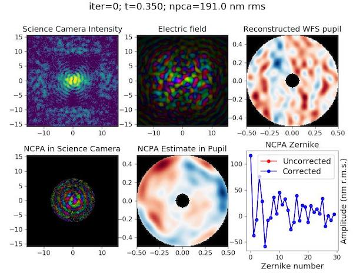

# fepsi

Python implementation of Phase Sorting Interferometry (PSI) for estimating non-common path errors in High Contrast Imaging (HCI) instruments.

The PSI code was written and developed by Emiel Por. Modifications (and subsequent bugs) by M. Kenworthy. PSI is described in ["Focal Plane Wavefront Sensing Using Residual Adaptive Optics Speckles" by Codona and Kenworthy (2013)](https://home.strw.leidenuniv.nl/~kenworthy/_media/papers:2013apj...767..100c.pdf), ApJ, 767, 100.

## Dependencies

Code requires `astropy` and `matplotlib` and `hcipy`.

[HCIPy](https://github.com/ehpor/hcipy) is a Python software package written and developed by Emiel Por for performing end-to-end simulations of high contrast imaging instruments for astronomy.

It can be installed from PyPI with:
```
pip install hcipy
```

## Quick Start

To install, clone this repository:
```
clone https://github.com/mkenworthy/fepsi.git
cd fepsi
```

See PSI in action by running `psi_ERIS.py`
```
python psi_ERIS.py
```



This is a toy AO system with the parameters for the 8.4m Very Large Telescope with the 4 micron camera ERIS. The WFS is read out at 1000Hz, the science camera read out at 20 Hz. An ideal coronagraph is used in the simulation.

The script will produce a movie `movie.mp4` and will generate frames for the movie and display them in real time, and the script typically takes 30 minutes on a modern computer to complete making the movie.

The non-common path errors are shown in the Zernike decomposition plot in the lower right corner as the black line. Image frames from the Science Camera and WFS Camera are generated every 50 milliseconds, and after 3 seconds of images, the NCPA is calculated with PSI and applied to the estimated NCPA with a small gain. As the simulation progresses, the red 'corrected' curve gets smaller and smaller and converges to zero, showing that PSI is converging towards zero NCPA.

## License

The code is released under a BSD 2-Clause License

